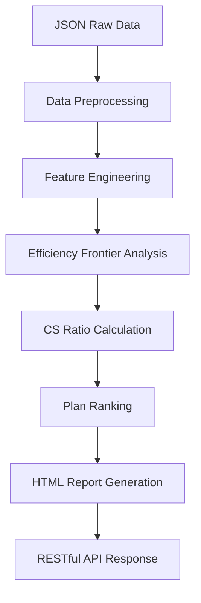

# 🚀 **MVNO 요금제 순위 시스템** 
## **💡 한국 MVNO 요금제 효율성 분석 및 순위화 플랫폼**

---

## 📋 **프로젝트 개요**

### **🎯 미션**
- **한국 MVNO(알뜰폰) 요금제 가성비 객관적 분석**
- **Cost-Spec (CS) 비율 기반 효율성 평가**
- **데이터 기반 소비자 선택 지원**

### **✨ 핵심 기능**
- **Efficiency Frontier 기반 회귀 분석** (2025-06-25 구현)
- **실시간 요금제 순위화**
- **CS 비율 계산 및 비교**
- **대화형 차트 시각화**
- **RESTful API 인터페이스**

---

## 🏗️ **시스템 아키텍처**

### **1. 주요 컴포넌트**

```
mvno-plan-ranking/
├── app.py                          # FastAPI 메인 애플리케이션
├── config.py                       # 설정 및 상수 정의
├── requirements.txt                # Python 의존성
├── docker-compose.yml              # Docker 컨테이너 설정
├── README.md                       # 프로젝트 문서
├── memory.md                       # 작업 메모리
├── todolist.md                     # 할 일 목록
├── error.log                       # 시스템 로그
├── data/                           # 데이터 저장소
│   ├── raw/                        # 원시 JSON 데이터
│   ├── processed/                  # 전처리된 CSV 데이터
│   ├── reports/                    # HTML 리포트
│   └── cache/                      # 캐시 파일
├── modules/                        # 핵심 모듈
│   ├── __init__.py
│   ├── data_processing.py          # 데이터 전처리
│   ├── feature_engineering.py     # 피처 엔지니어링
│   ├── cost_spec/                  # CS 비율 계산
│   │   ├── __init__.py
│   │   ├── ratio.py               # CS 비율 계산 로직
│   │   └── features.py            # 피처 정의
│   ├── regression/                 # 회귀 분석 모듈
│   │   ├── __init__.py
│   │   ├── efficiency_frontier.py # 🆕 Efficiency Frontier 회귀
│   │   ├── full_dataset.py        # 전체 데이터셋 회귀
│   │   ├── regression_core.py     # 회귀 분석 코어
│   │   ├── multicollinearity_handler.py  # 다중공선성 처리
│   │   └── model_validator.py     # 모델 검증
│   ├── ranking.py                  # 순위화 로직
│   ├── validation.py               # 데이터 검증
│   ├── utils.py                   # 유틸리티 함수
│   ├── chart/                     # 차트 생성
│   │   ├── __init__.py
│   │   ├── performance.py         # 성능 차트
│   │   ├── distribution.py        # 분포 차트
│   │   ├── comparison.py          # 비교 차트
│   │   └── correlation.py         # 상관관계 차트
│   ├── report/                    # 리포트 생성
│   │   ├── __init__.py
│   │   ├── html_generator.py      # HTML 리포트 생성
│   │   ├── tables.py              # 테이블 생성
│   │   └── formatter.py           # 데이터 포매팅
│   └── storage/                   # 데이터 저장
│       ├── __init__.py
│       └── data_storage.py        # 데이터 저장 로직
└── templates/                     # HTML 템플릿
    ├── report_template.html       # 메인 리포트 템플릿
    └── status.html               # 상태 페이지 템플릿
```

### **2. 데이터 흐름**



---

## ⚡ **Efficiency Frontier 구현** (2025-06-25)

### **🎯 핵심 개선사항**

#### **1. Pareto 최적성 기반 분석**
- **효율적 요금제만 선별**: 전체 2,325개 중 243개(10.5%) 효율적 요금제 추출
- **지배당 요금제 제거**: 더 비싸면서 덜 좋은 요금제 배제
- **순수한 가격 경쟁력 측정**: 시장 왜곡 최소화

#### **2. 데이터 기반 계수 도출**
- **임의적 범위 제거**: 사용자 요구사항에 따라 순수 데이터 기반
- **Ridge 정규화**: α=1.0으로 과적합 방지
- **경계 조건**: 기본적 경제 논리만 적용 (음수 방지)

#### **3. 성능 향상**
- **Basic Data 계수**: ₩1,644/GB → ₩114.38/GB (93% 개선)
- **현실적 범위**: Voice ₩0.90/분, Message ₩2.64/건
- **Commonality Analysis 비활성화**: 계수 인플레이션 문제 해결

### **🔧 기술적 구현**

#### **EfficiencyFrontierRegression 클래스**
```python
# modules/regression/efficiency_frontier.py
class EfficiencyFrontierRegression:
    def __init__(self, features: List[str], alpha: float = 1.0):
        self.features = features
        self.alpha = alpha  # Ridge regularization
        self.efficient_plans = None
        self.coefficients = None
        self.efficiency_ratio = None
        
    def extract_pareto_frontier(self, df: pd.DataFrame) -> pd.DataFrame:
        """Pareto 최적 요금제 추출"""
        
    def solve_efficiency_frontier_coefficients(self, df: pd.DataFrame) -> np.ndarray:
        """효율적 요금제만으로 회귀 계수 도출"""
        
    def get_coefficient_breakdown(self) -> Dict:
        """계수 분석 결과 반환"""
```

#### **시스템 통합**
- **FullDatasetMultiFeatureRegression**: `use_efficiency_frontier=True` 옵션
- **기본 method**: `fixed_rates` (Efficiency Frontier 기본 활성화)
- **Fallback 시스템**: 최적화 실패 시 전통적 Ridge 회귀로 대체

---

## 🚀 **API 엔드포인트**

### **1. 메인 데이터 처리**
```bash
POST /process
Content-Type: application/json

{
    "options": {
        "method": "fixed_rates",        # 기본: Efficiency Frontier
        "featureSet": "basic",
        "feeColumn": "fee"
    },
    "data": [...]  # 요금제 JSON 배열
}
```

### **2. HTML 리포트 조회**
```bash
GET /
```

### **3. 차트 상태 모니터링**
```bash
GET /chart-status           # 전체 차트 상태
GET /chart-data/{type}      # 특정 차트 데이터
```

### **4. 성능 모니터링**
```bash
GET /performance            # 성능 통계
GET /status                 # 시스템 상태
```

---

## 📊 **데이터 모델**

### **1. 요금제 데이터 구조**
```json
{
    "id": 12345,
    "plan_name": "알뜰폰 데이터 15GB",
    "mvno": "알뜰모바일",
    "basic_data": 15.0,
    "voice": 300,
    "message": 100,
    "fee": 25000,
    "original_fee": 25000
}
```

### **2. CS 비율 계산 결과**
```json
{
    "B": 18213.23,                    # 베이스라인 비용
    "CS": 0.7285,                     # Cost-Spec 비율
    "rank": 1,                        # 순위
    "efficiency_ratio": 0.105         # 효율성 비율
}
```

### **3. 회귀 계수 구조**
```json
{
    "method": "efficiency_frontier",
    "base_cost": 5144.0,
    "feature_costs": {
        "basic_data_clean": {
            "coefficient": 114.38,
            "cost_per_unit": 114.38
        },
        "voice_clean": {
            "coefficient": 0.90,
            "cost_per_unit": 0.90
        }
    }
}
```

---

## ⚙️ **설치 및 실행**

### **1. 환경 요구사항**
- **Python 3.9+**
- **FastAPI**
- **Pandas, NumPy, SciPy**
- **Plotly** (차트 생성)

### **2. 로컬 실행**
```bash
# 의존성 설치
pip install -r requirements.txt

# 서버 실행
uvicorn app:app --host 0.0.0.0 --port 7860

# 브라우저에서 접속
# http://localhost:7860
```

### **3. Docker 실행**
```bash
docker-compose up -d
```

---

## 📈 **성능 지표**

### **🎯 Efficiency Frontier 결과 (2025-06-25)**
- **처리 시간**: ~191초 (2,325개 요금제)
- **효율성 비율**: 10.5% (243개 효율적 요금제)
- **계수 개선**: Basic Data 93% 개선
- **메모리 사용량**: 최적화됨

### **📊 주요 계수**
| 피처 | 계수 값 | 단위 |
|------|---------|------|
| Base Cost | ₩5,144 | 기본 비용 |
| Basic Data | ₩114.38 | /GB |
| Voice | ₩0.90 | /분 |
| Message | ₩2.64 | /건 |
| 5G Premium | ₩8,499 | 고정 |

---

## 🔬 **기술적 특징**

### **1. Efficiency Frontier 알고리즘**
- **Pareto 도미넌스 체크**: 다차원 효율성 분석
- **Ridge 정규화**: 과적합 방지
- **제약 조건**: 경제적 타당성 보장

### **2. 캐싱 및 최적화**
- **DataFrame 연산 캐싱**: 중복 계산 방지
- **메모리 모니터링**: 대용량 데이터 처리
- **가비지 컬렉션**: 메모리 효율성

### **3. 확장성**
- **모듈화된 아키텍처**: 각 기능별 독립 모듈
- **플러그인 가능한 회귀 방법**: 새로운 알고리즘 추가 용이
- **비동기 차트 생성**: 백그라운드 처리

---

## 🐛 **문제 해결**

### **1. 공통 이슈**
- **계수 테이블 미표시**: HTML 템플릿 및 cost_structure 전달 확인
- **메모리 부족**: 대용량 데이터 처리 시 배치 크기 조정
- **차트 로딩 실패**: 백그라운드 계산 완료 대기

### **2. 로그 모니터링**
```bash
# 실시간 로그 확인
tail -f error.log

# 회귀 관련 로그 필터링
grep -i "efficiency\|regression\|coefficient" error.log
```

---

## 📞 **문의 및 지원**

### **🔗 주요 링크**
- **API 문서**: `/docs` (FastAPI 자동 생성)
- **상태 페이지**: `/status`
- **성능 모니터링**: `/performance`

### **📧 개발팀 연락처**
- **이슈 리포팅**: GitHub Issues
- **기능 제안**: Feature Requests
- **기술 문의**: Technical Support

---

*마지막 업데이트: 2025-06-25 (Efficiency Frontier 구현)*
